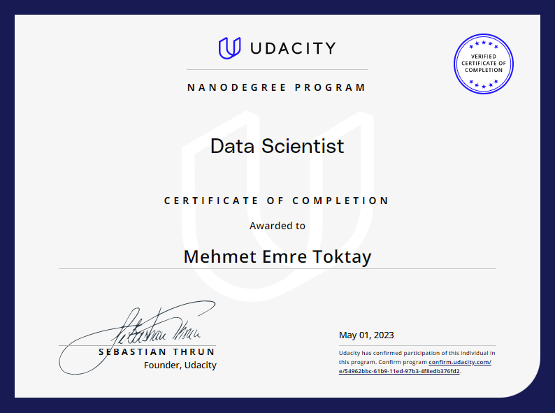

# Udacity-DSND
Collection of Projects of Udacity Data Scientist Nanodegree.

Project Lists:

1. Data Science: [Analysis of Stackoverflow’s 2021 and 2022 Annual Developer Survey for Turkish Data Scientists and Developers](https://github.com/EmreToktay/Data-Science-NanoDegree/tree/main/Introduction_to_data_science)
- [Blog Post](https://memretoktay.net/Blog%20Posts/Stackoverflow.html)

2. Unsupervised Learning: [Identify Customer Segments](https://github.com/EmreToktay/Data-Science-NanoDegree/tree/main/Unsupervised%20Learning)

3. Software Engineering [Data Dashboard Project](https://github.com/EmreToktay/Data-Science-NanoDegree/tree/main/Software%20Engineering)

4. Data Engineering: [Disaster Response Pipeline Project](https://github.com/EmreToktay/Data-Science-NanoDegree/tree/main/Data%20Engineering/Disaster%20Response%20Pipeline%20Project)

5. Recommendation System [IBM Recommandation System Project](https://github.com/EmreToktay/Data-Science-NanoDegree/tree/main/Experimental%20Design%20%26%20Recommandations/IBM%20Recommendation%20System%20Project)

6. Capstone Projects: [Dog Breed Classification Using Convolutional Neural Networks](https://github.com/EmreToktay/Data-Science-NanoDegree/tree/main/Capstone%20Project/Dog%20Breed%20Classifier)
- [Blog Post](https://memretoktay.net/Blog%20Posts/Dog%20Breed%20Classifier.html)
